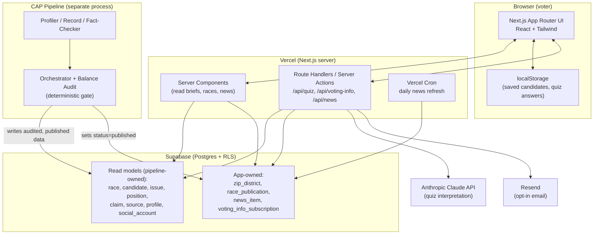

# PRD — Know Your Vote

*Technical blueprint for the voter-facing web app of the Civic Awareness Project (CAP). Read alongside `product-vision.md` (strategy/brand) and the authoritative backend specs: `CAP_Schema_v1.md` (data schema), `CAP_Agent_Plan_v1.md`, `CAP_MCP_Tool_Spec_v1.md`, `CAP_Balance_Audit_Spec_v1.md`, `CAP_Logging_Schema_v1.md`. Visual tokens live in `docs/design.md` (generate via the Design System skill before styling work).*

---

## 1. Overview

### Product Summary

**Know Your Vote** is a nonpartisan civic web app that lets a Florida voter enter their ZIP code (or pick their county) and instantly see every candidate in their races laid out side by side — with *What They Say*, *What They've Done*, and *Fact-Check* cleanly separated, and every claim traceable to a source. It is the presentation layer over the existing CAP pipeline: the pipeline's agents and deterministic Balance Audit produce neutrality-audited briefs; this app reads and renders only what has passed that gate. Four sections — **Candidates, Races, News, Find My Candidates** — are reachable from a persistent nav bar docked to the bottom on mobile and the top on desktop.

### Objective

This PRD covers the **MVP** as defined in `product-vision.md § 3 (MVP Definition)`: ZIP/county resolution, the Races section with side-by-side candidate briefs, the Candidates section with device-local saves, the Find My Candidates quiz (Claude-interpreted, "learn more" framing), the daily Local Electoral News feed, opt-in where-to-vote email, the four-section navigation, and the methodology page — all scoped to Florida's four target metros (Miami/Miami-Dade, Fort Lauderdale/Broward, Tampa/Hillsborough, Orlando/Orange) and the statewide + FL-28/FL-23/FL-15/FL-10 races.

### Market Differentiation

The technical implementation must deliver *verifiable* neutrality, not just claimed neutrality. That means: the app never authors or edits a claim (it renders audited pipeline output only); it only ever reads races whose every candidate Profile has `balance_check_passed = true` and whose publication status is `published`; candidate order within a race is a fixed neutral rule applied identically to all; and every rendered claim links to its `Source`. If the implementation cannot guarantee "published-and-audited-only," the differentiation is lost.

### Magic Moment

*In under a minute, a voter enters their ZIP and sees every candidate in their races laid out side by side — equal space, equal scrutiny — with what they say, what they've done, and what's been fact-checked, each traceable to a source.* Technically this requires: (1) fast, correct ZIP→races resolution; (2) briefs **pre-generated** by the pipeline and only *read* at request time (never generated in the request path); (3) a side-by-side layout that renders all candidates equally on a phone. The path from landing to moment is exactly land → enter ZIP → open race; nothing may block it (no signup, no onboarding).

### Success Criteria

- Time to magic moment < 60 seconds from landing (ZIP entry → rendered brief).
- Race view page load LCP < 2.0s on a mid-tier phone over 4G; briefs are statically/server-rendered.
- 100% of rendered claims carry at least one linked `Source` (enforced by the read query — a claim with no `claim_source` row is never displayed).
- Only races with all Profiles `balance_check_passed = true` **and** `race_publication.status = 'published'` are ever reachable by the public.
- All P0 functional requirements implemented; ZIP resolution verified correct against a known-address test set across all four metros.

---

## 2. Technical Architecture

### Architecture Overview



**Key boundary:** the CAP pipeline **writes**; the web app **reads** (with two narrow exceptions it writes: `voting_info_subscription` on opt-in, and `news_item` via the daily cron job). The app has no ability to author `claim`, `profile`, or verdict data.

### Chosen Stack

| Layer | Choice | Rationale |
|---|---|---|
| Frontend | Next.js (App Router) + React + TypeScript + Tailwind CSS | SSR/SSG for fast, SEO-friendly, daily-updated civic content; strongest AI-coding-agent support; Tailwind maps cleanly to `design.md` tokens |
| Backend | Next.js Route Handlers + Server Actions on Vercel; Vercel Cron for the daily refresh | No separate backend service; server-side secrets (Claude, Resend, Supabase service role) never reach the client |
| Database | Supabase (Postgres) | Matches the existing CAP schema exactly; enum `CHECK`s + FKs enforce "buckets are sacred" and "no source → dropped" at the DB level; RLS exposes only published data |
| Auth | None (device-local) | Anonymous by default; saved candidates and quiz answers live in `localStorage`; no accounts, no login |
| Analytics | Plausible (cookieless) | Privacy-first, no personal data, no consent banner; instruments aggregate funnel events only |
| Email | Resend | Opt-in transactional email only (polling place, deadlines, reminders) |
| Error tracking | Sentry | Client + server error capture with strict PII scrubbing (no ZIP, email, or IP in payloads) |

*(Payments: none — free civic tool. See §10.)*

### Stack Integration Guide

**Setup order:**
1. `create-next-app` (TypeScript, App Router, Tailwind). Configure `tailwind.config.ts` from the `design.md` token front-matter once it exists.
2. Create the Supabase project (or reuse the pipeline's). Add the app-owned tables (§3) via a migration. Confirm the pipeline-owned read models already exist per `CAP_Schema_v1.md`.
3. Wire two Supabase clients: a **server client** using the anon key for public reads (RLS-restricted), and a **service-role client** used *only* in server code for `voting_info_subscription` writes and the cron job. Never ship the service-role key to the client.
4. Add the Anthropic SDK (`@anthropic-ai/sdk`) and Resend SDK (`resend`), both server-only.
5. Initialize Sentry (client + server) with `beforeSend`/`beforeBreadcrumb` scrubbers that drop ZIP, email, and IP.
6. Add Plausible via its script tag / Next.js integration; define custom events for the funnel.

**Integration patterns:**
- **Reads go through Server Components** hitting Supabase directly with the anon client — no bespoke REST layer for browsing races/candidates/briefs. RLS is the security boundary.
- **Mutations and AI/email go through Route Handlers** (`/api/*`) so secrets stay server-side.
- **The quiz never sends PII to Claude** — only the ZIP (to resolve races) and the issue answers; no name, email, or identifiers.

**Common gotchas:**
- Don't let the public anon key read `voting_info_subscription`. Lock it with RLS (no anon `SELECT`) and only touch it via the service-role client in server code.
- Cache race/brief pages aggressively (they change at most daily), but **revalidate** them when the cron job runs or a race's publication status changes, so a newly-published or re-audited race appears promptly. Use `revalidateTag`/`revalidatePath`.
- Split ZIPs (a ZIP spanning two congressional districts) must not silently pick one district — fall back to the county picker / district confirmation (see §11).

**Required environment variables:**
`NEXT_PUBLIC_SUPABASE_URL`, `NEXT_PUBLIC_SUPABASE_ANON_KEY`, `SUPABASE_SERVICE_ROLE_KEY` (server only), `ANTHROPIC_API_KEY` (server only), `RESEND_API_KEY` (server only), `NEXT_PUBLIC_PLAUSIBLE_DOMAIN`, `SENTRY_DSN`, `SENTRY_AUTH_TOKEN`, `CRON_SECRET` (guards the cron route), `EMAIL_FROM` (verified Resend sender).

Optional: `SHOW_CANDIDATE_CONTACT` (server only) — the candidate-page contact block from `candidate_contact` stays unrendered until this is `"true"` (CAP_Refresh_Agents_Plan §8 Q3: flip only after the first real R2 run's data is approved).

### Repository Structure

```
know-your-vote/
├── src/
│   ├── app/
│   │   ├── (public)/
│   │   │   ├── page.tsx                 # Landing + ZIP entry (magic-moment entry)
│   │   │   ├── races/
│   │   │   │   ├── page.tsx             # Races list for a resolved location
│   │   │   │   └── [raceId]/page.tsx    # Side-by-side candidate briefs
│   │   │   ├── candidates/
│   │   │   │   ├── page.tsx             # Saved ("keep in mind") list
│   │   │   │   └── [candidateId]/page.tsx
│   │   │   ├── news/page.tsx            # Local Electoral News feed
│   │   │   ├── find-my-candidates/page.tsx  # Quiz
│   │   │   └── methodology/page.tsx     # "How we stay fair"
│   │   ├── api/
│   │   │   ├── resolve/route.ts         # ZIP -> county/district/races
│   │   │   ├── quiz/route.ts            # Claude-interpreted matching
│   │   │   ├── voting-info/route.ts     # Opt-in email (polling place/deadlines)
│   │   │   ├── voting-info/unsubscribe/route.ts
│   │   │   ├── news/route.ts            # News items for a location
│   │   │   └── cron/refresh-news/route.ts   # Daily job (CRON_SECRET-guarded)
│   │   ├── layout.tsx                   # Root layout + SectionNav
│   │   └── globals.css
│   ├── components/
│   │   ├── ui/                          # Design-system primitives (button, card, input)
│   │   ├── nav/SectionNav.tsx           # Bottom (mobile) / top (desktop) nav bar
│   │   └── features/
│   │       ├── ZipEntry.tsx
│   │       ├── RaceCompare.tsx          # Side-by-side layout, equal columns
│   │       ├── CandidateBrief.tsx       # Say / Done / Fact-Check sections
│   │       ├── SavedCandidates.tsx
│   │       ├── Quiz.tsx
│   │       └── NewsFeed.tsx
│   ├── lib/
│   │   ├── supabase/server.ts           # anon read client
│   │   ├── supabase/service.ts          # service-role client (server-only)
│   │   ├── resolve.ts                   # ZIP/county resolution logic
│   │   ├── briefs.ts                    # published-only brief read queries
│   │   ├── quiz.ts                      # Claude prompt + response parsing
│   │   ├── saved.ts                     # localStorage helpers
│   │   └── analytics.ts                 # Plausible event helpers
│   └── types/                           # Shared TS types mirroring the schema
├── supabase/migrations/                 # App-owned table migrations only
├── public/
├── .env.local
└── ...
```

### Infrastructure & Deployment

- **Host:** Vercel (Next.js-native). Preview deploys per PR; production on `main`.
- **Database:** Supabase cloud (shared with the pipeline, or a read-replica/schema the pipeline writes to). The app connects with the anon key (public reads) and the service-role key (server-only writes).
- **Scheduled jobs:** Vercel Cron hits `/api/cron/refresh-news` daily (e.g. 06:00 ET); the route verifies `CRON_SECRET`, reads recent pipeline events + publication changes, and upserts `news_item` rows, then revalidates affected pages.
- **Caching/ISR:** race and brief pages use ISR with tag-based revalidation keyed on `race_publication.published_at`. Static where possible; the ZIP resolver and quiz are dynamic.

### Security Considerations

- **RLS is the boundary.** Public (anon) role: `SELECT` only on published read models and `news_item`; **no access** to `voting_info_subscription`. All writes to `voting_info_subscription` go through server code using the service-role key after server-side validation and explicit consent.
- **Published-only invariant.** The public brief query joins `race_publication` (`status='published'`) and filters `profile.balance_check_passed = true`; unpublished/failing races are unreachable, not merely hidden in the UI.
- **No PII to third parties.** The quiz sends only ZIP + issue answers to Claude. Sentry is configured to scrub ZIP, email, and IP from all events and breadcrumbs. Plausible is cookieless and stores no personal data.
- **Input validation.** Validate ZIP (5-digit US), email (RFC + MX-lightweight), and quiz payloads with `zod` at every route handler. Rate-limit `/api/quiz` and `/api/voting-info` (e.g. Vercel edge middleware or Upstash) to deter abuse.
- **Email safety.** Double-opt-in optional; always include an unsubscribe link (tokenized) and honor it. Store the minimum: email, ZIP, consent timestamp, unsubscribe token.
- **Secrets** live only in Vercel env; service-role key, `ANTHROPIC_API_KEY`, `RESEND_API_KEY`, and `CRON_SECRET` are never `NEXT_PUBLIC_`.

### Cost Estimate

At MVP scale (< 1,000 users, four metros), monthly cost is essentially free-tier. *Verify each against current provider pricing before launch.*

| Service | Expected tier | Rough monthly |
|---|---|---|
| Vercel | Hobby/Pro | $0–20 |
| Supabase | Free / Pro | $0–25 |
| Anthropic (Claude) | Pay-as-you-go | Low — the quiz is a small prompt; at hundreds of completions/month with a mid-tier model (e.g. `claude-sonnet-5`), on the order of a few dollars. Verify against current Anthropic pricing. |
| Resend | Free (3,000 emails/mo) | $0 |
| Plausible | Starter | $0–9 (or self-host free) |
| Sentry | Free (developer quota) | $0 |

Total: roughly **$0–80/month** at launch scale, dominated by whichever paid tiers you opt into for headroom.

---

## 3. Data Model

The app **reads** the pipeline-owned schema and **owns** four additional tables. The pipeline-owned schema is authoritative in `CAP_Schema_v1.md` — do not redefine or migrate it here; the summaries below are the read shapes the app depends on.

### Entity Definitions

**Pipeline-owned (read-only for the app — see `CAP_Schema_v1.md` for full constraints):**

- `race` — `race_id` (PK), `office`, `level` (`federal|state`), `district`, `election` (`primary|general`), `is_open_seat`, `incumbent_id`, `key_dates` (primary/general/registration).
- `candidate` — `candidate_id` (PK), `legal_name`, `party` (`REP|DEM|NPA|other`), `office_sought`, `is_incumbent`, `qualifying_status`, `prior_offices`, `official_site`, `fec_id`.
- `candidate_social_account` — `(platform, handle_norm)` unique; app renders **only** rows with `status='verified'`.
- `source` — `source_id` (PK), `url`, `publisher`, `type`, `lean_tag`, `retrieved_at`.
- `claim` — `claim_id` (PK), `candidate_id`, `race_id`, `issue_id`, `text`, `bucket` (`verifiable_fact|stated_position|outside_opinion`), `attributed`, `derived_from`, `verdict` (six-value or null), `verification`.
- `claim_source` — join table; **a claim with zero rows here is never displayed.**
- `issue` — `issue_id` (PK), `race_id`, `tier` (`spine|candidate`), `candidate_id?`, `title`, `display_order`.
- `position` — `(candidate_id, issue_id)` unique; `stance_summary`, `claim_ids`, `coverage` (`stated|no_stated_position_found`).
- `profile` — `(candidate_id, race_id)` unique; `audit` block with `balance_check_passed`, `verifiable_fact_count`, `fact_checks_performed`, `spine_issues_covered`, `flag_reason`, `flagged_at`.

**App-owned (define via migration in `supabase/migrations/`):**

```sql
-- ZIP -> jurisdiction resolution (seed from Census/official FL data)
CREATE TABLE zip_district (
  zip5                  CHAR(5) NOT NULL,
  county_fips           CHAR(5) NOT NULL,
  county_name           TEXT NOT NULL,
  congressional_district TEXT,                 -- e.g. 'FL-28'; null if unknown
  metro                 TEXT,                   -- 'miami' | 'fort_lauderdale' | 'tampa' | 'orlando' | null
  is_split              BOOLEAN NOT NULL DEFAULT false,  -- true if this ZIP spans >1 district
  in_coverage           BOOLEAN NOT NULL DEFAULT false,  -- true for the 4 target metros
  PRIMARY KEY (zip5, congressional_district)
);
CREATE INDEX idx_zip_district_zip ON zip_district (zip5);

-- Publication gate: a race is public only when status='published'
CREATE TABLE race_publication (
  race_id       TEXT PRIMARY KEY REFERENCES race(race_id),
  status        TEXT NOT NULL DEFAULT 'draft'
                  CHECK (status IN ('draft','in_review','published')),
  published_at  TIMESTAMPTZ,
  note          TEXT
);

-- Local Electoral News feed items (pipeline events + curated official links;
-- migration 0005 adds candidate_id + the agent-written candidate_news /
-- election_news item_types per CAP_Refresh_Agents_Plan §5)
CREATE TABLE news_item (
  id            UUID PRIMARY KEY DEFAULT gen_random_uuid(),
  race_id       TEXT REFERENCES race(race_id),       -- null = statewide/general
  metro         TEXT,                                 -- optional scope
  item_type     TEXT NOT NULL CHECK (item_type IN ('pipeline_event','official_link','candidate_news','election_news')),
  title         TEXT NOT NULL,                        -- neutral wording
  summary       TEXT,
  url           TEXT,                                 -- official/primary link when applicable
  source_id     TEXT REFERENCES source(source_id),    -- provenance when from a Source
  published_at  TIMESTAMPTZ NOT NULL DEFAULT NOW()
);
CREATE INDEX idx_news_item_scope ON news_item (race_id, metro, published_at DESC);

-- The ONLY table holding personal data. Opt-in email delivery.
CREATE TABLE voting_info_subscription (
  id                UUID PRIMARY KEY DEFAULT gen_random_uuid(),
  email             TEXT NOT NULL,
  zip5              CHAR(5) NOT NULL,
  consent_at        TIMESTAMPTZ NOT NULL DEFAULT NOW(),
  unsubscribe_token TEXT NOT NULL UNIQUE DEFAULT encode(gen_random_bytes(16),'hex'),
  last_sent_at      TIMESTAMPTZ,
  active            BOOLEAN NOT NULL DEFAULT true,
  UNIQUE (email, zip5)
);
```

**No `user` table. No `saved_candidate` table.** Saved candidates and in-progress quiz answers are stored client-side in `localStorage` (keys: `kyv.saved` = array of `candidate_id`; `kyv.quiz` = last answers). This is deliberate — anonymous by default.

### Relationships

- `race 1—* candidate` (via `race.candidate_ids` / `candidate.office_sought` mapping in the pipeline).
- `race 1—1 race_publication` (the publish gate).
- `candidate 1—* position`, `position *—1 issue`, `position *—* claim` (via `claim_ids`).
- `claim *—* source` through `claim_source` (cascade delete on claim).
- `news_item *—1 race` (nullable), `news_item *—1 source` (nullable).
- `zip_district` resolves `zip5 → county + congressional_district(s) → races`.

### Indexes

- `zip_district(zip5)` — primary lookup path for resolution.
- `news_item(race_id, metro, published_at DESC)` — feed queries scoped to a voter's location, newest first.
- `voting_info_subscription(unsubscribe_token)` (unique) — token lookups for unsubscribe.
- Rely on the pipeline schema's existing indexes for reads (`profile(candidate_id, race_id)`, `claim(race_id)`, `position(candidate_id, issue_id)`, `idx_social_lookup`).

---

## 4. API Specification

### API Design Philosophy

Reads for browsing (races, candidates, briefs, news lists) happen in **Server Components** querying Supabase directly with the anon client — no REST layer needed, RLS enforces access. **Route Handlers** (REST-ish, JSON) exist only for interactions that need server secrets or side effects: ZIP resolution, the Claude quiz, and opt-in email. Errors return `{ error: string, details?: unknown }` with appropriate status codes. All request bodies are validated with `zod`.

### Endpoints

```
GET /api/resolve?zip=33101
Auth: none
Response 200: {
  zip: "33101",
  inCoverage: true,
  county: "Miami-Dade",
  district: "FL-28",
  isSplit: false,
  races: [ { raceId, office, level, district, published: true } ]
}
Response 200 (split ZIP): { zip, inCoverage, isSplit: true, county, candidateDistricts: ["FL-27","FL-28"], races: [] , needsCountyConfirm: true }
Response 200 (out of coverage): { zip, inCoverage: false, message: "We don't cover this area yet." }
Response 400: { error: "Invalid ZIP" }
```

```
POST /api/quiz
Auth: none
Body: { zip: string, answers: Array<{ issueId?: string, questionId: string, choice?: string, freeText?: string }> }
Behavior: resolve zip -> races; read published candidates + their stated positions; send ONLY the issue
          answers + candidate stated-position summaries to Claude (no PII); Claude returns per-candidate
          alignment notes across the FULL field (never a ranking, never "vote for").
Response 200: {
  races: [ { raceId, office } ],
  results: [ { candidateId, party, alignmentNote: string, alignedIssues: string[] } ],   // ALL candidates included
  disclaimer: "These are candidates whose stated positions line up with your answers — a starting point for learning, not a recommendation."
}
Response 400: { error, details }
Response 429: { error: "Too many requests" }
```

```
POST /api/voting-info
Auth: none
Body: { zip: string, email: string, consent: true }
Behavior: validate; upsert voting_info_subscription (service-role, server-side); look up polling place +
          deadlines for the ZIP; send via Resend; never store more than email+zip+consent+token.
Response 200: { ok: true }
Response 400: { error: "Consent required" | "Invalid email" | "Invalid ZIP" }
Response 429: { error: "Too many requests" }
```

```
GET /api/voting-info/unsubscribe?token=...
Auth: none (token is the credential)
Behavior: set active=false for the matching subscription.
Response 200: { ok: true }   Response 404: { error: "Unknown token" }
```

```
GET /api/news?zip=33101   (or ?metro=miami)
Auth: none
Response 200: { items: [ { id, itemType, title, summary, url, publishedAt, raceId, candidateId } ] }   // newest first, published scope only
```

```
POST /api/cron/refresh-news
Auth: header 'x-cron-secret' must equal CRON_SECRET
Behavior: read recent pipeline events (new claims/verdicts/filings, re-audits, new publications) since last run;
          generate neutral news_item rows; revalidate affected race/news pages.
Response 200: { inserted: number }   Response 401: { error: "Unauthorized" }
```

---

## 5. User Stories

### Epic: See My Ballot

**US-001: Resolve my ballot by ZIP**
As Maria, I want to enter my ZIP and see my races so that I know what's actually on my ballot.
Acceptance Criteria:
- [ ] Given a valid in-coverage ZIP, when I submit it, then I see my statewide races and my congressional race.
- [ ] Given an out-of-coverage ZIP, when I submit it, then I see a friendly "not covered yet" message with the option to pick a county.
- [ ] Edge case: a split ZIP → I'm asked to confirm my county/district rather than shown a guessed one.

**US-002: Read a race side by side**
As Maria, I want to see every candidate in a race next to each other so that I can compare them fairly.
Acceptance Criteria:
- [ ] Given a published race, when I open it, then all candidates render in equal-width, equal-structure columns/cards.
- [ ] Given a candidate, when I read their brief, then *What They Say*, *What They've Done*, and *Fact-Check* are visually distinct and every item has a source link.
- [ ] Edge case: an unpublished/failing race is never reachable (404 / "in review").

### Epic: Find My Candidates

**US-003: Take the quiz**
As Devon, I want to answer a few issue questions and see aligned candidates so that I have a starting point.
Acceptance Criteria:
- [ ] Given I complete the quiz, when results render, then ALL candidates in my races are shown with a neutral alignment note.
- [ ] Given results, then the framing is "learn more," never a ranking or "vote for."
- [ ] Edge case: free-response that's off-topic or empty → handled gracefully, no crash, no fabricated alignment.

### Epic: Keep In Mind & Voting Info

**US-004: Save candidates**
As Priya, I want to bookmark candidates so that I can find them and their official links later.
Acceptance Criteria:
- [ ] Given a candidate, when I tap "keep in mind," then they appear in my Candidates list on return visits (no login).
- [ ] Given a saved candidate, then I see their official site and verified social handles.

**US-005: Get where-to-vote by email**
As Maria, I want my polling place and deadlines emailed to me so that I can actually vote.
Acceptance Criteria:
- [ ] Given I enter my ZIP + email and consent, when I submit, then I receive an email with my polling place and key dates.
- [ ] Given any email, then it includes a working unsubscribe link.
- [ ] Edge case: no consent → request rejected with a clear message.

### Epic: Stay Current & Trust

**US-006: Follow local electoral news**
As Maria, I want a calm feed of what changed so that I stay current without doomscrolling.
Acceptance Criteria:
- [ ] Given my location, when I open News, then I see neutral, dated items scoped to my races, newest first.
- [ ] Given the feed, then items are pipeline events or curated official links — no external hot-takes.

**US-007: Understand how you stay fair**
As a skeptic, I want to see the methodology so that I can decide whether to trust it.
Acceptance Criteria:
- [ ] Given any brief, when I look for it, then there's a link to a plain-language methodology page.
- [ ] Given the methodology page, then it explains the say/do/true separation, the Balance Audit, and shows scrutiny counts.

---

## 6. Functional Requirements

**FR-001: ZIP/County Resolution** — Priority: P0
Description: Resolve a ZIP (or selected county) to county + congressional district + the voter's races via `zip_district`. Handle split ZIPs by requesting county/district confirmation. Handle out-of-coverage gracefully.
Acceptance: Correct races for known test addresses across all four metros; split ZIPs never auto-pick; out-of-coverage shows a friendly message.
Related: US-001

**FR-002: Races List** — Priority: P0
Description: Show the resolved voter's races (statewide + their district), each linking to the race view. Show election dates and the "closed primary" note where relevant.
Acceptance: All target races appear for an in-coverage ZIP; each links to a published race view.
Related: US-001, US-002

**FR-003: Side-by-Side Race View** — Priority: P0
Description: Render all candidates in a race with identical layout and structure, organized under the race's spine issues. Candidate order is a fixed neutral rule (ballot order, else alphabetical by legal name) applied identically.
Acceptance: Equal columns/cards on mobile and desktop; no candidate visually privileged; order rule is deterministic.
Related: US-002

**FR-004: Candidate Brief (Say / Done / Fact-Check)** — Priority: P0
Description: For each candidate, render the three audited sections from pipeline data — `stated_position` (Say), `verifiable_fact` (Done), and Fact-Checker verdicts (Fact-Check) — grouped by issue, each claim with source link(s) and verdicts where present. Show `no_stated_position_found` honestly for uncovered spine issues.
Acceptance: Matches pipeline output; every displayed claim has ≥1 `claim_source`; verdicts use the fixed six-value labels.
Related: US-002

**FR-005: Published-Only Read Layer** — Priority: P0
Description: The public read query returns only races where `race_publication.status='published'` and all Profiles `balance_check_passed=true`. Enforced in the query + RLS, not just UI.
Acceptance: Unpublished/failing races 404 for the public; verified by test.
Related: US-002, US-007

**FR-006: Four-Section Navigation** — Priority: P0
Description: Persistent nav (Candidates, Races, News, Find My Candidates) docked bottom on mobile, top on desktop, with clear active state.
Acceptance: Reachable from every page; responsive dock position; keyboard accessible.
Related: all

**FR-007: Find My Candidates Quiz** — Priority: P1
Description: Collect ZIP + multiple-choice + free-response issue answers; resolve races; send answers + candidate stated-position summaries (no PII) to Claude; return per-candidate alignment notes for the FULL field with "learn more" framing.
Acceptance: All candidates shown; neutral framing; no ranking; graceful handling of empty/off-topic free text.
Related: US-003

**FR-008: Saved Candidates (device-local)** — Priority: P1
Description: "Keep in mind" toggles a candidate into `localStorage`; the Candidates section lists saved candidates with official site + verified handles.
Acceptance: Persists across visits with no account; unsave works; empty state guides the user.
Related: US-004

**FR-009: Local Electoral News Feed** — Priority: P1
Description: Show `news_item` rows scoped to the voter's races/metro, newest first. Populated daily by the cron job from pipeline events + curated official links.
Acceptance: Updates daily; neutral titles; no external opinion content.
Related: US-006

**FR-010: Where-to-Vote Opt-In Email** — Priority: P2
Description: ZIP + email + explicit consent → store minimal subscription, send polling place + deadlines via Resend, include unsubscribe.
Acceptance: Email delivered; unsubscribe works; no PII beyond email+zip+consent+token stored; Sentry scrubs it from logs.
Related: US-005

**FR-011: Methodology Page** — Priority: P0
Description: Plain-language explanation of the say/do/true separation, the Balance Audit gate, sourcing rules, and per-race scrutiny counts. Linked from every brief.
Acceptance: Linked from brief footer; renders scrutiny counts from `profile.audit`.
Related: US-007

**FR-012: Flag a Brief** — Priority: P2
Description: A "flag this brief as biased" link routing to the existing pipeline flag path/form.
Acceptance: Present on every brief; submission acknowledged.
Related: US-007

---

## 7. Non-Functional Requirements

### Performance
- Race/brief pages: LCP < 2.0s on mid-tier mobile / 4G; server- or statically-rendered with ISR.
- ZIP resolution response < 300ms (p95); quiz end-to-end < 8s (bounded by the Claude call, with a loading state).
- Initial JS bundle < 200KB gzipped for public pages.

### Security
- OWASP Top 10 addressed; all inputs validated with `zod`.
- RLS: no anon access to `voting_info_subscription`; service-role key server-only.
- Rate limiting on `/api/quiz` and `/api/voting-info`.
- Sentry scrubs ZIP/email/IP; no PII in logs or analytics.

### Accessibility
- WCAG 2.1 AA: full keyboard navigation, visible focus, screen-reader-tested nav and briefs, sufficient contrast (verify against `design.md` tokens).
- The side-by-side race view must remain readable and operable at 320px width and with a screen reader (candidates as a logical reading order, not just visual columns).

### Scalability
- Support ≥ 1,000 concurrent readers on Vercel + Supabase free/pro tiers via ISR/edge caching of read-heavy pages (traffic is read-dominated and spikes around election dates).

### Reliability
- 99.5% uptime target for public read pages (static/ISR degrade gracefully).
- Graceful degradation: if Claude is down, the quiz shows a "try again shortly" message and still links to full briefs; if Resend is down, the email request queues/retries or reports failure honestly; a failed cron run leaves yesterday's feed intact.

---

## 8. UI/UX Requirements

> **Visual tokens are defined in `docs/design.md`** (sage-green + warm-sand palette, humanist type — Figtree/Inter, minimalist straight-lined layout, border-led elevation) with a live style-guide mirror in `docs/design.html`. Use those token and component names when implementing. Component names below (e.g. `section-nav`, `race-compare`, `candidate-brief`) are structural; style them from the `design.md` primitives (`button-primary`, `card`, `input-text`, `nav-item`, `verdict-badge`, `party-chip`, `chip`). Two hard rules from `design.md § Do's and Don'ts`: party chips are uniform/neutral (never red/blue), and verdict color is always paired with a text label.

### Screen: Landing / ZIP Entry
Route: `/`
Purpose: Get the voter to their ballot in one step (magic-moment entry).
Layout: Minimal hero — one line of copy ("See your ballot, laid out fairly"), a prominent ZIP input with a "See my ballot" button, and a subtle "or pick your county" link. `section-nav` present.
States: **Empty:** input ready, no error. **Loading:** button spinner while resolving. **Populated:** on success, route to `/races`. **Error:** inline "We couldn't match that ZIP — double-check it, or pick your county."
Key Interactions: submit ZIP → `/api/resolve` → route to races or show county fallback.
Components: `input-zip`, `button-primary`, `section-nav`, `link-subtle`.

### Screen: Races
Route: `/races` (location held in URL/query or localStorage)
Purpose: Show the voter's races.
Layout: Location summary at top ("Miami-Dade · FL-28") with a change-location control; a list of race cards (office, dates, closed-primary note).
States: **Empty:** "Enter your ZIP to see your races." **Loading:** skeleton cards. **Populated:** race cards. **Error:** retry affordance.
Key Interactions: change location; tap a race → `/races/[raceId]`.
Components: `location-picker`, `card`, `section-nav`.

### Screen: Race View (side-by-side)
Route: `/races/[raceId]`
Purpose: Compare all candidates fairly.
Layout: Race header (office, dates); `race-compare` layout with equal columns per candidate on desktop, and an accessible stacked/tabbed equal-treatment layout on mobile; each candidate rendered via `candidate-brief`. Footer: methodology + flag links.
States: **Empty/unpublished:** "This race is still in review." (404-like). **Loading:** skeletons per candidate. **Populated:** full briefs. **Error:** retry.
Key Interactions: expand issue sections; open a source link; "keep in mind" toggle; jump to methodology.
Components: `race-compare`, `candidate-brief`, `issue-section`, `verdict-badge`, `source-link`, `save-toggle`.

### Screen: Candidate Detail
Route: `/candidates/[candidateId]`
Purpose: One candidate in depth + official links.
Layout: Candidate header (name, party, incumbent flag), official site + verified handles, full brief by issue, save toggle.
States: standard empty/loading/populated/error.
Components: `candidate-brief`, `handle-list`, `save-toggle`.

### Screen: Candidates (saved)
Route: `/candidates`
Purpose: The voter's "keep in mind" list.
Layout: List of saved candidates with quick links; clear empty state.
States: **Empty:** "You haven't saved anyone yet. Tap 'keep in mind' on any candidate." **Populated:** saved list. (No loading/error — local.)
Components: `card`, `handle-list`, `section-nav`.

### Screen: Find My Candidates (quiz)
Route: `/find-my-candidates`
Purpose: Interest-based discovery, framed for learning.
Layout: ZIP step → issue questions (multiple-choice + free-response) → results. Results always show the full field with alignment notes and the "not a recommendation" disclaimer.
States: **Empty:** intro + start. **Loading:** "Reading your answers…" during the Claude call. **Populated:** results. **Error:** "Couldn't process that — try again," briefs still linked.
Components: `quiz-step`, `choice-group`, `textarea`, `result-card`, `disclaimer-note`.

### Screen: News
Route: `/news`
Purpose: Calm daily digest of what changed.
Layout: Location-scoped, dated list of `news_item`s, newest first; each item neutral title + optional official link.
States: **Empty:** "No updates yet for your area." **Loading:** skeleton list. **Populated:** feed. **Error:** retry.
Components: `news-item`, `section-nav`.

### Screen: Methodology
Route: `/methodology`
Purpose: Earn trust; explain fairness.
Layout: Plain-language sections (say/do/true, Balance Audit, sourcing) + a scrutiny-counts panel.
Components: `prose`, `scrutiny-counts`.

### Component: Section Navigation
Docked bottom on mobile (thumb-reachable), top on desktop. Four items with icons + labels and a clear active state. Keyboard/screen-reader accessible.

---

## 9. Auth Implementation

This app does not require authentication. Saved candidates and quiz answers are stored in `localStorage`; there are no user accounts. The only personal data handled is an opt-in email address for where-to-vote delivery (see §3 `voting_info_subscription` and §6 FR-010), which is written server-side with the service-role key and is never exposed to the public read layer. If accounts/cross-device sync are added later, revisit this section — a passwordless (magic-link) provider such as Supabase Auth would be the natural fit, but it is explicitly out of scope for the MVP.

## 10. Payment Integration

Not applicable. Know Your Vote is a free civic tool with no paid tiers, checkout, or subscriptions. If funding ever requires donations, integrate a dedicated donation flow (e.g. a hosted Stripe/Every.org link) *outside* the core voter experience so it never colors the neutrality of the content.

## 11. Edge Cases & Error Handling

### Feature: ZIP Resolution
| Scenario | Expected Behavior | Priority |
|---|---|---|
| Invalid/short ZIP | Inline validation error; no request sent | P0 |
| Split ZIP (spans districts) | Ask for county/district confirmation; never auto-pick | P0 |
| Out-of-coverage ZIP | Friendly "not covered yet" + county picker | P0 |
| ZIP valid but no published races yet | "Your races aren't published yet — check back soon" | P1 |

### Feature: Race / Brief Rendering
| Scenario | Expected Behavior | Priority |
|---|---|---|
| Race unpublished or failing Balance Audit | Unreachable to public (404 / "in review") | P0 |
| Claim missing a source | Not displayed at all (query excludes it) | P0 |
| Candidate has no stated position on a spine issue | Show "no stated position found" honestly | P0 |
| Uneven candidate content within a published race | Composer already capped space symmetrically upstream; render as-is | P1 |

### Feature: Quiz (Claude)
| Scenario | Expected Behavior | Priority |
|---|---|---|
| Claude API timeout/error | "Couldn't process that — try again"; briefs remain accessible | P1 |
| Off-topic / empty free-response | Handle gracefully; no fabricated alignment; ask to elaborate or skip | P1 |
| Model returns a ranking or "vote for" phrasing | Post-process/guard the output to enforce full-field, non-ranking framing | P1 |
| Rate limit exceeded | 429 with friendly retry message | P2 |

### Feature: Voting-Info Email
| Scenario | Expected Behavior | Priority |
|---|---|---|
| No consent checkbox | Reject with clear message | P0 |
| Invalid email | Inline validation error | P1 |
| Resend failure | Report honestly; offer retry; don't claim success | P1 |
| Unsubscribe token unknown | 404 with neutral message | P2 |

### Feature: News Cron
| Scenario | Expected Behavior | Priority |
|---|---|---|
| Cron auth fails | 401; no writes | P0 |
| Pipeline source unavailable | Leave prior feed intact; log; retry next run | P1 |

## 12. Dependencies & Integrations

### Core Dependencies (install latest compatible — do not pin)
```json
{
  "next": "*",
  "react": "*",
  "react-dom": "*",
  "@supabase/supabase-js": "*",
  "@supabase/ssr": "*",
  "@anthropic-ai/sdk": "*",
  "resend": "*",
  "zod": "*",
  "tailwindcss": "*",
  "@sentry/nextjs": "*"
}
```

### Development Dependencies
```json
{
  "typescript": "^5.x",
  "eslint": "^9.x",
  "eslint-config-next": "*",
  "prettier": "*",
  "vitest": "*",
  "@playwright/test": "*"
}
```

### Third-Party Services
- **Supabase** — Postgres + RLS. Env: `NEXT_PUBLIC_SUPABASE_URL`, `NEXT_PUBLIC_SUPABASE_ANON_KEY`, `SUPABASE_SERVICE_ROLE_KEY`. Shared with the CAP pipeline (app reads; writes only app-owned tables).
- **Anthropic Claude API** — quiz interpretation. Env: `ANTHROPIC_API_KEY`. Server-only. Recommended model: a current mid-tier Claude (e.g. `claude-sonnet-5`) for latency/cost; swap to a flagship (e.g. `claude-opus-4-8`) if free-response quality needs it. Send no PII. Verify model IDs and pricing against current Anthropic docs.
- **Resend** — opt-in transactional email. Env: `RESEND_API_KEY`, `EMAIL_FROM`. Free tier ~3,000 emails/mo.
- **Plausible** — cookieless analytics. Env: `NEXT_PUBLIC_PLAUSIBLE_DOMAIN`. Events: `zip_resolved`, `brief_viewed`, `quiz_completed`, `candidate_saved`, `voting_info_requested` — aggregate only, no identifiers.
- **Sentry** — error tracking. Env: `SENTRY_DSN`, `SENTRY_AUTH_TOKEN`. Configure PII scrubbing (drop ZIP/email/IP).
- **External data (via the pipeline, not the app):** FL Division of Elections, FEC API, FL Legislature, Census (for `zip_district` seed). The app consumes their *processed* output from Supabase.

## 13. Out of Scope

- **User accounts / cross-device sync** — contradicts anonymous-by-default; adds auth + privacy surface. Reconsider only on clear user demand.
- **Mass SMS delivery** — needs A2P 10DLC registration + TCPA compliance. Reconsider post-launch.
- **Geography beyond the four FL metros** — depth first. Next expansion is the remaining FL districts, then state legislature.
- **User comments / ratings / any UGC** — reintroduces the bias/moderation problem the project exists to avoid.
- **External news aggregation** — inconsistent with pipeline-and-official-sources neutrality control.
- **In-app candidate rebuttals / claim disputes** — route through the existing pipeline flag path for now.
- **Push notifications** — not in MVP.

## 14. Open Questions

- **ZIP→district data source and split-ZIP handling.** Options: Census ZCTA↔CD crosswalk (free, ZIP-level, imperfect on splits) vs. address-level geocoding (accurate, more work/privacy). *Recommended default:* seed `zip_district` from the Census crosswalk with `is_split` flags and fall back to a county/district picker; revisit address-level only if resolution errors surface.
- **Polling-place + deadline data for the email.** Options: FL Supervisor-of-Elections per-county sources vs. a third-party civic API (e.g. a voting-info API). *Recommended default:* start with curated official county sources for the four metros; evaluate an API when expanding.
- **Where the daily news cron reads pipeline events from.** Options: directly off `action_log`/`claim` changes vs. a pipeline-published "events" view. *Recommended default:* a dedicated read view the pipeline maintains, so the app never couples to internal log internals.
- **Quiz model + guardrail placement.** Confirm the model tier and whether the non-ranking/full-field guarantee is enforced purely by prompt or also by a post-processing check. *Recommended default:* both — prompt for it and validate/normalize the response server-side before returning.
- **Analytics choice.** `VISION.md` picks Plausible for privacy; confirm vs. a cookieless PostHog if richer funnels are wanted later.
